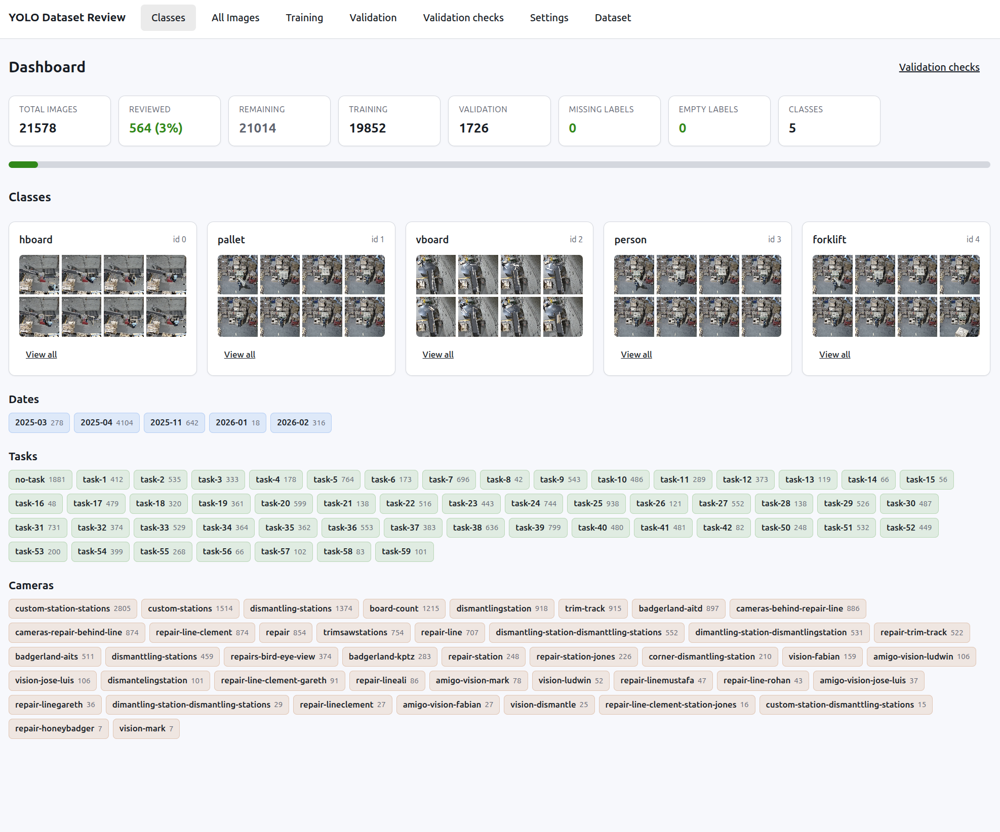
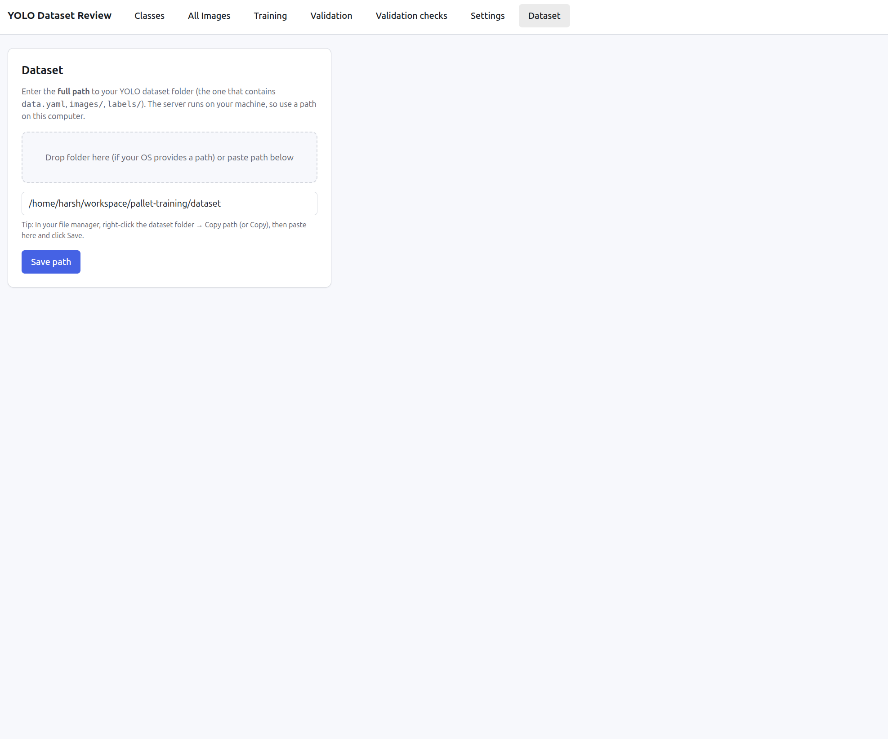
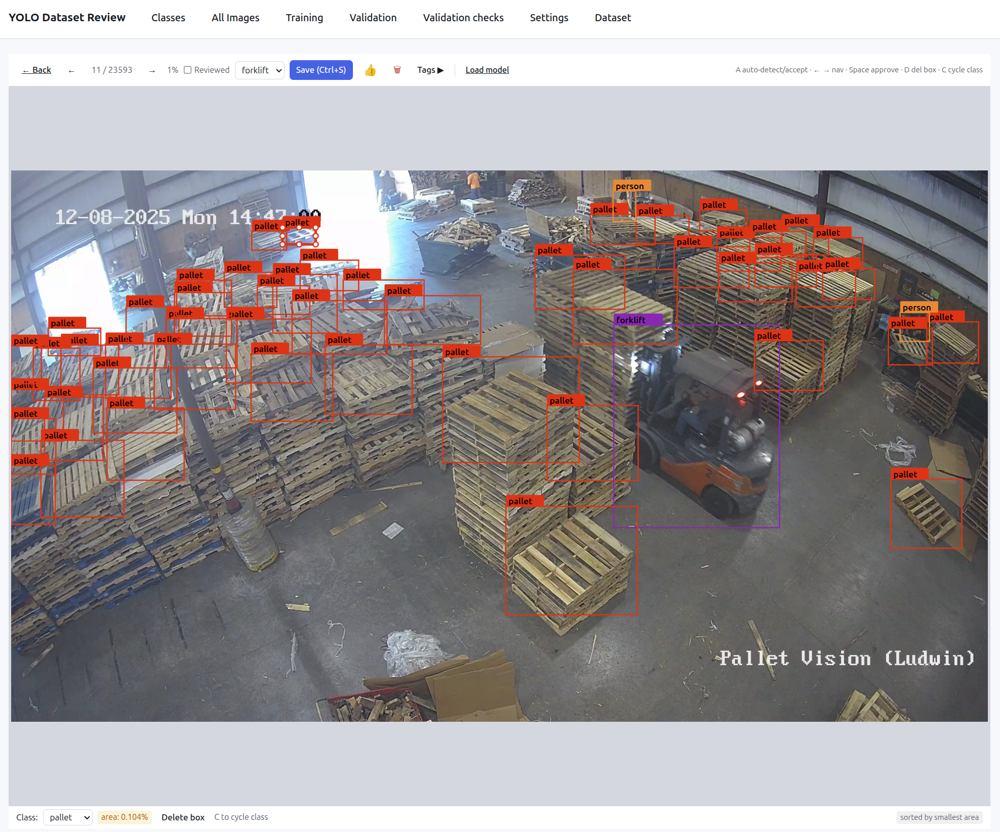
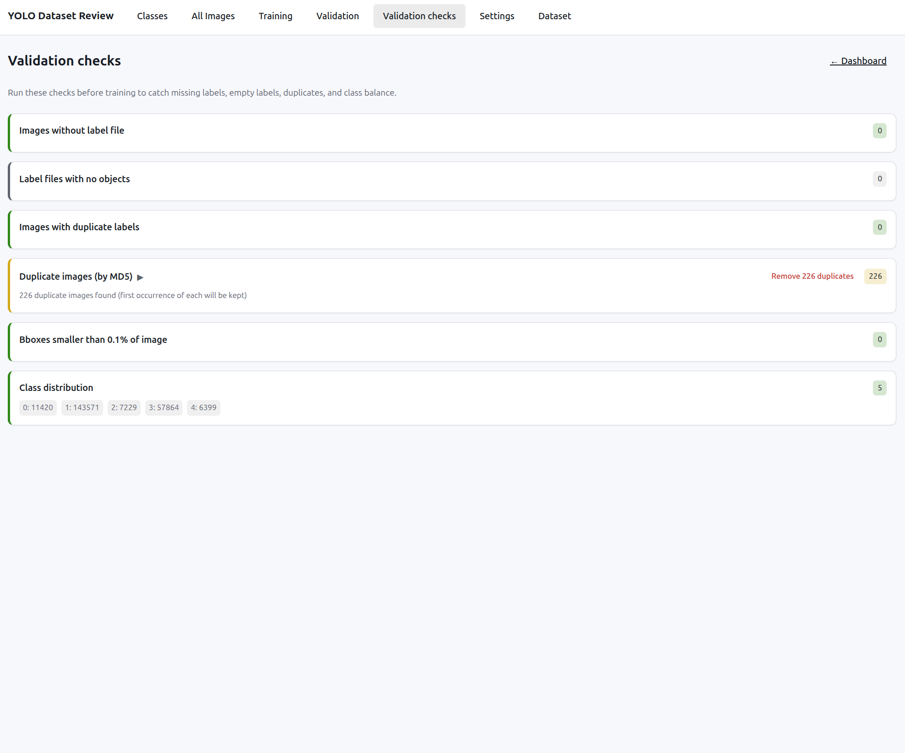

# YOLO Dataset Review

A **local web app** for reviewing, annotating, and cleaning YOLO-format object-detection datasets. Point it at a folder, browse images and labels, fix boxes, run validation checks, and optionally use a trained YOLO model to auto-detect and accept predictions—all in the browser with no data leaving your machine.

  
*Dashboard: class stats, sample thumbnails, and review progress.*

---

## Features

- **Dataset browser** — Open any YOLO dataset by path (paste or drag-drop). Supports standard and Roboflow-style layouts; auto-detects `data.yaml` and common directory patterns.
- **Class dashboard** — See per-class counts, sample thumbnails, and overall review progress (total images, reviewed %, missing/empty labels).
- **Image grids by split** — Browse **All Images**, **Training**, **Validation**, and **Test** with pagination, “reviewed” filter, and optional tag filters (e.g. by date, task, camera). Filter further by **class** and sort by **bounding-box area** to quickly spot spurious or tiny annotations.
- **Annotation editor** — Open any image to view and edit bounding boxes: draw, resize, change class, delete. Changes are written back to YOLO `.txt` label files.
- **Review tracking** — Mark images as reviewed and move quickly with keyboard shortcuts (e.g. next/prev, mark reviewed, cycle class). Progress is stored in a `review/` folder inside your dataset.
- **Validation suite** — Detect and fix common issues: missing labels, empty labels, duplicate labels, duplicate images (by hash), very small bboxes, and view class distribution.
- **Optional model inference** — Run a Python sidecar that loads a YOLO `.pt` model; in the app, use “Auto-detect” to get predictions as dashed boxes, then accept per-box or “Accept all.”
- **Custom class colors** — Set colors per class in Settings for consistent visualization.
- **Per-image tags** — Attach custom tags to images (e.g. “reviewed”, “reject”); filter by tags in the image grid when supported by your dataset layout.

---

## Quick start

### Prerequisites

- **Node.js** (v18+ recommended)
- For **model inference**: Python 3.8+ with `pip install fastapi uvicorn ultralytics`

### Install and run

```bash
git clone https://github.com/visionify/dataset-review.git
cd dataset-review
npm install
npm run dev
```

This starts:

- **API server** at `http://localhost:3456`
- **Vite dev server** at `http://localhost:5173`

Open **http://localhost:5173** in your browser.

### First-time setup

1. Go to **Dataset** (in the nav).
2. Paste the **absolute path** to your YOLO dataset folder, or drag-and-drop the folder onto the input.
3. Click **Save**. The app will load the dataset and you’ll see **Classes** (dashboard) and **All Images** in the nav.

  
*Dataset page: paste or drag-drop your dataset path. *

---

## How to use the web app

### 1. Choose your dataset (**Dataset**)

- Enter the full path to the folder that contains your YOLO dataset (e.g. `/home/user/datasets/my_yolo_dataset`).
- You can paste the path or drag the folder from your file manager into the input.
- The server expects a layout like `images/train`, `labels/train`, and a `data.yaml` (or `dataset.yaml`). Both “images per split” and “split per folder” (e.g. Roboflow) styles are supported.

### 2. Dashboard (**Classes**)

- View **total images**, **reviewed count**, and **remaining**.
- See counts per split (train / val / test) and quick stats for **missing labels** and **empty labels** (with links to Validation).
- Use the **Classes** cards to see sample thumbnails per class; click a class to open **Class detail** and browse all images for that class.
- If your dataset has tag metadata (e.g. dates, tasks, cameras), you’ll see filter chips to narrow the image list.

  
*Classes dashboard with stats and sample thumbnails. *

### 3. Browse images (**All Images**, **Training**, **Validation**, **Test**)

- Use the nav to open **All Images** or a specific split.
- Optionally filter by **Reviewed** (e.g. “Not reviewed only”) or by **tags** (date, task, camera) when available.
- Use the **class filter** dropdown to narrow results to images containing a specific class. Once a class is selected, the **sort-by-area** dropdown appears, letting you sort by bounding-box area (smallest or largest first) — useful for finding spurious tiny annotations.
- Click an image to open the **annotation view** for that image.

  
*Image grid with split and filters. *

### 4. Annotate and review (**Image detail**)

- **View** — Image is shown with current bounding boxes overlaid; each class uses the color from Settings.
- **Select** — Click a box to select it (highlighted). Use **D** or **Delete** to remove it; **C** or **0–9** to change class; double-click the box to cycle class.
- **Draw** — Add new boxes by drawing on the image; the default class is used unless you pick another.
- **Navigate** — **← / →** or **Space** to save, mark reviewed, and go to previous/next image.
- **Auto-detect** (optional) — If the inference server is running and a model is loaded (see Settings), use **A** or the “Auto-detect” button. Predictions appear as dashed boxes; click one to accept it, or “Accept all” to merge all into the label file.

  
*Annotation view: boxes, class list, and optional predictions.*

### 5. Run validation (**Validation checks**)

- Open **Validation checks** from the nav or from the dashboard links.
- Review issues: **missing labels**, **empty labels**, **duplicate labels**, **duplicate images** (by MD5), **very small bboxes** (<0.1% of image area), and **class distribution**.
- For many checks you can **fix** in bulk (e.g. remove duplicate label lines, delete images without labels, remove duplicate images, drop tiny boxes).

  
*Validation checks and fix actions. *

### 6. Customize (**Settings**)

- **Class colors** — Set a hex color per class so boxes are easy to distinguish.
- **Model (optional)** — If you run the Python inference server, paste the path to your `.pt` file and click **Load model**. Then the “Auto-detect” action is available in the annotation view. You can set confidence threshold and unload when done.

---

## What can you do with this?

- **Review and correct labels** — Go through train/val/test images, fix mislabeled boxes, wrong classes, or missing detections, and mark images as reviewed so you don’t lose progress.
- **Clean a new dataset** — After exporting from another tool (e.g. Roboflow, CVAT), open the folder, run **Validation checks**, fix missing/empty/duplicate labels and duplicate images, then do a first pass of annotation review.
- **Bootstrap labels with a model** — Load your own YOLO `.pt` model, run Auto-detect on images, then accept or tweak predictions and save as YOLO labels. Great for semi-automatic labeling or fixing old datasets with a better model.
- **Audit class balance** — Use the dashboard and Validation’s class distribution to see which classes are over/under-represented before training.
- **Work offline and locally** — All data stays on your machine; no cloud or account required. The `review/` folder (reviewed set, tags, class colors) is self-contained and can be committed or copied with the dataset.

---

## Dataset layout

The app supports common YOLO layouts and auto-detects config. Expected structure:

```
/path/to/dataset/
├── data.yaml              # or dataset.yaml / dataset_weighted.yaml
├── images/train/          # or train/images/
├── images/val/            # or valid/images/
├── labels/train/
├── labels/val/
└── review/                # created by the app
    ├── reviewed.json      # which images are marked reviewed
    ├── class-colors.json  # custom class colors
    ├── metadata.json
    └── tags/              # per-image tags
```

All review state lives under `review/` — safe to commit, copy, or delete to reset without touching original images or labels.

---

## Optional: model inference (auto-detect)

To use a YOLO model for predictions inside the app:

1. Install deps and start the Python server:

   ```bash
   pip install fastapi uvicorn ultralytics
   python server/inference.py    # listens on port 3457
   ```

2. In the app: **Settings** → paste path to your `.pt` file → **Load model**.
3. In the annotation view, use **A** or the **Auto-detect** button. Predictions appear as dashed boxes; click to accept one or **Accept all**.

| Key   | Action                          |
|-------|----------------------------------|
| `A`   | Run auto-detect / Accept all     |
| Click | Accept that single prediction   |

---

## Keyboard shortcuts (annotation view)

| Key        | Action                                   |
|------------|------------------------------------------|
| `←` / `→`  | Save, mark reviewed, prev/next image    |
| `Space`    | Mark reviewed and go to next             |
| `D`        | Delete selected bounding box             |
| `C`        | Cycle selected box’s class                |
| `Delete`   | Delete selected box (or delete image if none selected) |
| `0`–`9`    | Set selected box’s class by index        |
| `A`        | Auto-detect / Accept all predictions     |
| `Ctrl+S`   | Manual save                             |
| `T`        | Toggle tags panel                        |
| Double-click bbox | Cycle class                      |

---

## Scripts

| Command           | Description                          |
|-------------------|--------------------------------------|
| `npm run dev`     | Start API + Vite (concurrently)      |
| `npm run dev:server` | API only (port 3456)             |
| `npm run dev:vite`   | Vite only (port 5173)             |
| `npm run build`   | TypeScript check + production build  |
| `npm run preview` | Serve production build (Vite)        |

---

## Architecture

- **Backend**: Express (`server/index.js`) — file I/O, YAML parsing, image/label CRUD, validation, proxy to inference.
- **Inference**: Optional Python FastAPI (`server/inference.py`) — loads a YOLO `.pt` model and runs inference (port 3457).
- **Frontend**: React + Vite, TypeScript — `api.ts` (typed API), `BBoxCanvas` (image + SVG boxes), pages for Classes, Images, Image detail, Validation, Config, Settings.

---

## API reference

For integration or scripting, the backend exposes:

| Method | Path | Purpose |
|--------|------|---------|
| GET    | `/api/config` | Current dataset path |
| POST   | `/api/config` | Set dataset path |
| GET    | `/api/dataset/summary` | Stats: classes, counts, reviewed |
| GET    | `/api/images?split=&page=&limit=&reviewed=&tagType=&tag=&classId=&sort=` | Paginated image list (classId filters by class; sort=area_asc/area_desc sorts by bbox area) |
| GET    | `/api/images/:split/:name` | Serve image file |
| DELETE | `/api/images/:split/:name` | Delete image + label |
| GET/PUT| `/api/annotations/:split/:base` | YOLO bbox annotations |
| GET/PUT| `/api/tags/:split/:base` | Per-image tags |
| GET/PATCH | `/api/reviewed` | Reviewed image set |
| GET/PUT | `/api/class-colors` | Custom class colors |
| GET    | `/api/validation` | Missing/empty/duplicate/small bbox checks |
| GET    | `/api/inference/health` | Model status (proxied to Python) |
| POST   | `/api/inference/load` | Load a .pt model |
| POST   | `/api/inference/predict` | Run inference on an image |
| POST   | `/api/inference/unload` | Unload current model |

---

## License

Use and adapt as you like. If you found this useful, a star or link back is appreciated. You can also visit our website at [www.visionify.ai](https://visionify.ai) for our Workplace Safety Software.

---

